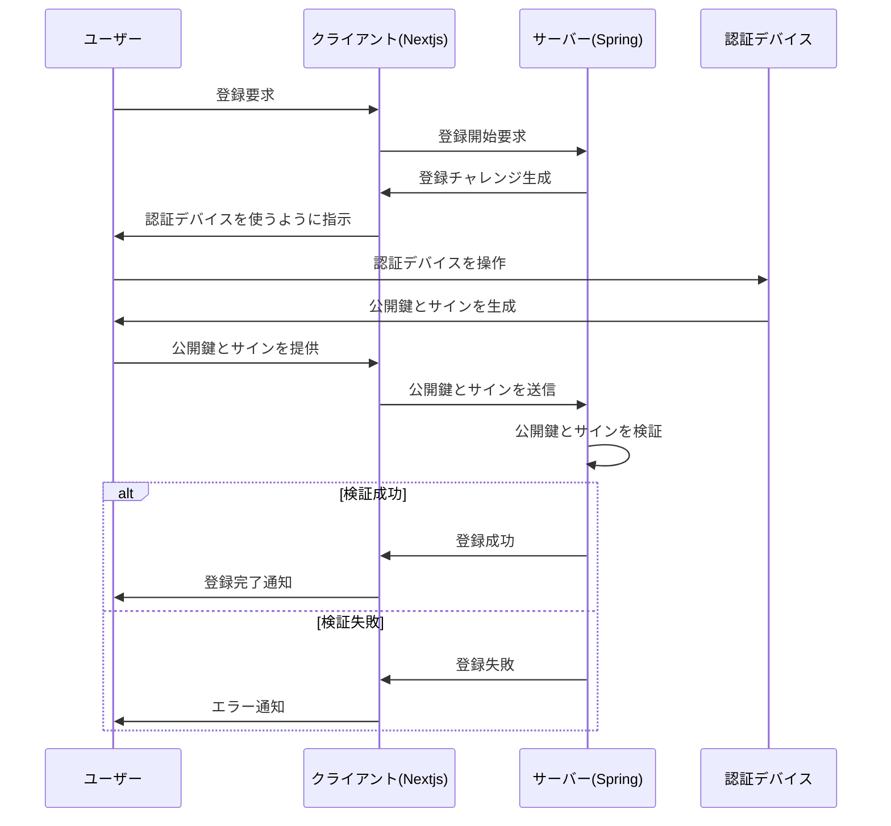

# webauthn-demo

### フロー図

登録

```mermaid
sequenceDiagram
    participant User as ユーザー
    participant Client as クライアント(Nextjs)
    participant Server as サーバー(Spring)
    participant Device as 認証デバイス
    User ->> Client: 登録要求
    Client ->> Server: 登録開始要求
    Server ->> Client: 登録チャレンジ生成
    Client ->> User: 認証デバイスを使うように指示
    User ->> Device: 認証デバイスを操作
    Device ->> User: 公開鍵とサインを生成
    User ->> Client: 公開鍵とサインを提供
    Client ->> Server: 公開鍵とサインを送信
    Server ->> Server: 公開鍵とサインを検証
    alt 検証成功
        Server ->> Client: 登録成功
        Client ->> User: 登録完了通知
    else 検証失敗
        Server ->> Client: 登録失敗
        Client ->> User: エラー通知
    end
```