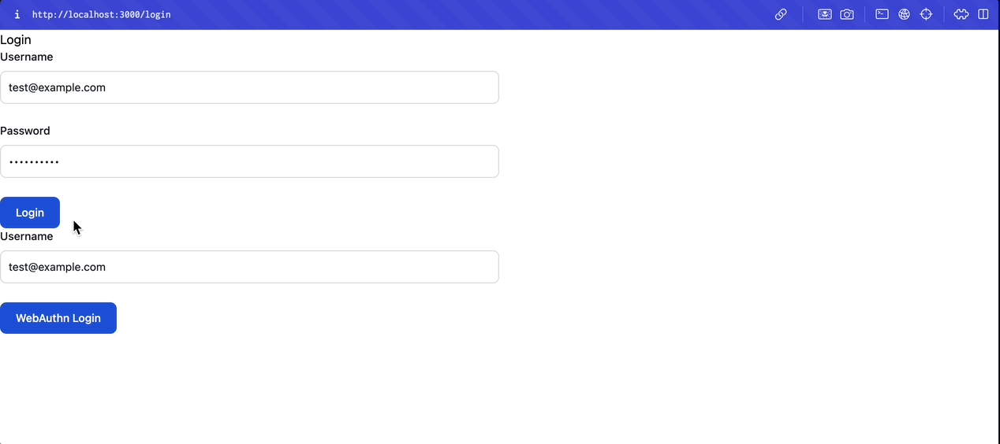

# webauthn-demo

## 起動方法

サーバーサイドアプリケーションの起動

```shell
./gradlew bootRun
```

フロントエンドアプリケーションの起動

```shell
cd front-demo/
npm run dev
```

> [!WARNING]
> envファイルにサーバーサイドのエンドポイントを指定する必要あり。ループバックアドレスは`127.0.0.1`
> ではなく`localhost`を指定すること

### デモ

